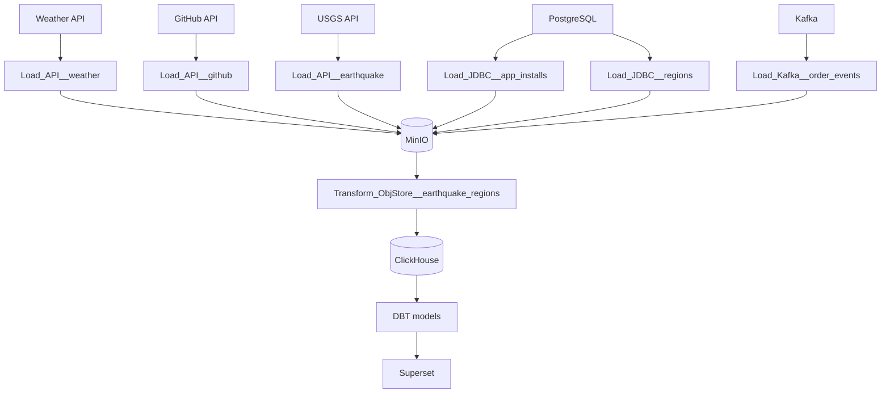

# Weather ETL

Репозиторий демонстрирует работу ETL‑пайплайна, который собирает данные из API, PostgreSQL и Kafka, сохраняет их в MinIO и ClickHouse и формирует витрины при помощи DBT. Оркестрация процессов выполняется в Apache Airflow, визуализация – в Superset, мониторинг – в Prometheus и Grafana.

## Структура проекта

- `dags/` – DAG‑файлы Airflow.
  - `Create_Postgres__app_installs.py` – генерация событий установки приложения в PostgreSQL.
  - `Create_Postgres__order_events.py` – генерация событий статусов заказов в PostgreSQL.
  - `Load_API__weather.py` – загрузка текущей погоды из Open‑Meteo и сохранение в MinIO.
  - `Load_API__github.py` – сохранение публичных событий GitHub в MinIO.
  - `Load_API__earthquake.py` – ежедневное обновление данных о землетрясениях USGS в MinIO.
  - `Load_JDBC__regions.py` – полный перенос справочника регионов из PostgreSQL в MinIO.
  - `Load_JDBC__app_installs.py` – инкрементальная выгрузка таблицы `app_installs` в MinIO.
  - `Load_Kafka__order_events.py` – потоковая загрузка событий заказов из Kafka в MinIO.
  - `Transform_ObjStore__earthquake_regions.py` – объединение данных о землетрясениях и регионах в ClickHouse.
- `scripts/` – Python и Spark‑скрипты, вызываемые задачами DAG‑ов.
- `dbt_click/` – DBT‑проект для построения витрин в ClickHouse.
- `clickhouse/` – инициализация баз данных ClickHouse.
- `bash_control/` – скрипты `up.sh` и `down.sh` для запуска и остановки docker‑композа.
- `debezium-*/` – конфигурации Debezium, Prometheus и Grafana.
- `airflow_dockerfile/`, `jupyter_dockerfile/`, `superset_dockerfile/` – пользовательские Docker‑образы.
- `docker-compose.yaml` – описание локального окружения.

```text
weather_etl/
├── dags/
│   ├── Create_Postgres__app_installs.py
│   ├── Create_Postgres__order_events.py
│   ├── Load_API__earthquake.py
│   ├── Load_API__github.py
│   ├── Load_API__weather.py
│   ├── Load_JDBC__app_installs.py
│   ├── Load_JDBC__regions.py
│   ├── Load_Kafka__order_events.py
│   └── Transform_ObjStore__earthquake_regions.py
├── scripts/
│   ├── load/
│   └── transform/
├── dbt_click/
├── clickhouse/
├── docker-compose.yaml
└── bash_control/
```

## Используемые технологии

- **Apache Airflow** – оркестрация ETL‑процессов.
- **Apache Spark** – пакетная и потоковая обработка данных.
- **Kafka + Debezium** – потоковая передача изменений из PostgreSQL.
- **ClickHouse** – аналитическая СУБД для хранения витрин.
- **MinIO (S3)** – объектное хранилище для Data Lake.
- **DBT** – моделирование данных в ClickHouse.
- **Superset** – визуализация результатов.
- **Prometheus + Grafana** – мониторинг и дашборды.
- **Jupyter Notebook** – интерактивный анализ.

## Процесс работы пайплайна

1. `bash_control/up.sh` поднимает инфраструктуру через `docker-compose`.
2. DAG‑и из каталога `dags/` получают данные из API, PostgreSQL и Kafka и сохраняют их в MinIO.
3. Spark‑задача `Transform_ObjStore__earthquake_regions` обогащает данные и записывает результат в ClickHouse.
4. DBT‑проект `dbt_click` строит аналитические модели поверх ClickHouse.
5. Superset подключается к ClickHouse и отображает дашборды.
6. Работа сервисов отслеживается в Prometheus и Grafana.
7. Стек останавливается командой `bash_control/down.sh`.

## Схема пайплайна


